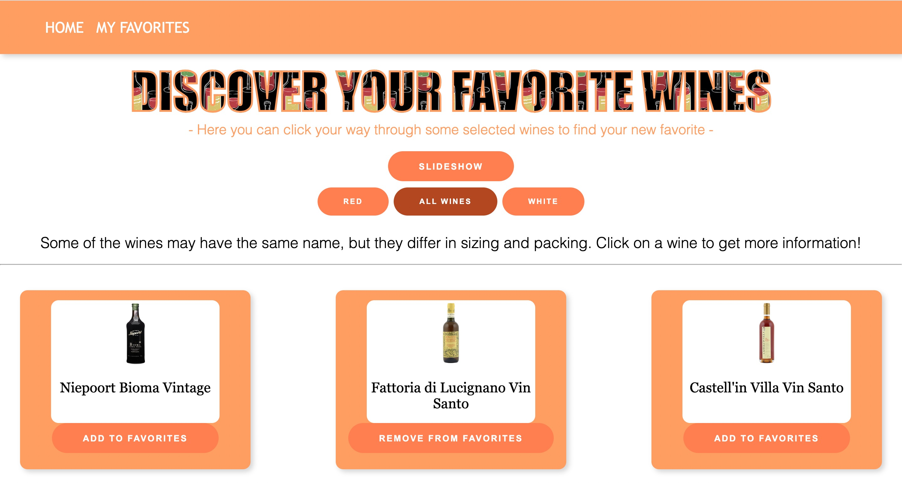
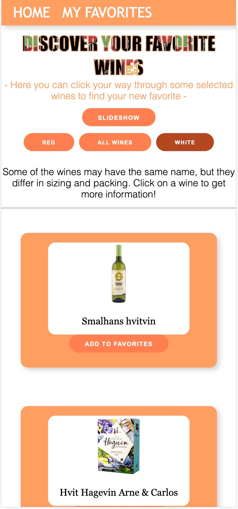

# Wineopedia 🍇🍷

## About the application:

Wineopedia is a user-friendly application designed for wine enthusiasts who want to explore and enjoy a wide range of wines.
This application gives you the opportunity to explore wines in a practical way, regardless of whether you are a new wine enthusiast
or experienced with wine from before.

You can easily browse wines from Vinmonopolet.no, including red, white and other varieties. You can mark your personal favorite wines
with a single tap and create your own list of which wines you have a good eye for. This list is always avaliable from the navbar.

If you want to bring up only red wine or only white wine, the application has a filter for white wines, red wines and all wines.
This is so that the user can get a clear overview and easily find the desired wine taste.

## How to run the application:

```bash
cd prosjekt1
```

Start by installing the application:

```bash
npm install

npm run dev
```

To ensure code formatting, you can run prettier:

```bash

npx prettier . -c

```

To check for other errors, you can run:

```bash

npx run lint

```

Now the app is up and running at http://localhost:5173/project1

## Testing:

More detailes around testing can be found [here]("prosjekt1/src/test/README.md")

How to run the tests:

```bash
cd prosjekt1

npm install

npm run test
```

### Filestructure

Here is the filestructure of the projects containing the most important folders and what they contain.

- [Filestructure](docs/filestructure.md)

## Choices

### How we interpreted the requirements:

We interpreted the requirement "A user should be able to make a choice (e.g., filtering or sorting) that affects the selection of what is presented and how it is presented. These choices should be remembered even if the page is reloaded" somewhat incorrectly.

- We initally thought that the requirement was fulfilled by having a separate page for favorites (the selection of what is presented) and by
  allowing users to switch between slideshow and list view (how it is presented). We also thought that the requirement to display one
  resource at a time was covered by having a slideshow, but we later on added a separate page for each product to meet the requirement.

We realized that we had misunderstood the requirement after implementing these functionalities and chose to keep them on the website.

### Bug in slideshow

We had a bug in the slideshow because the length of the white wine and red wine lists was shorter than the length of all wines.

- This meant that when you scrolled far in "All wines" and then switched the filter to red or white, we couldn't access the wine because
  it couldn't fetch such a large index from the smaller lists. We resolved this by setting the index to 0 when switching filters.

- This introduced some minor issues in the app, but we chose to include them rather than the larger errors. These minor issues were
  that when you transition from a large index in "All wines" and then to "red" or "white," the item at index 0 would appear,
  and reappear when you scrolled right for the first time. The second issue is that when you view the first item in the list,
  you cannot scroll backward because the application does not support an index lower than 0.

<ins> Update regarding this bug </ins>

We did not have the time to solve this issue, but we see that it could be solved by implementing a global state manager for the index state. This was not a requirement for project 1, but we have learned the value of this during P2.

### Filtering only by name

The REST API we choose did not contain any variables for wether the wine was red, wine or something else. To be able to filter the wine on its type, we checked if the wine name contained "Hvit" and "Rød".

In result of this there were a few wines that were actually a part of these categories that were not displayed under its respective category. These were only displayed under "All wines".

We initially focused on finding a small API, which resulted in us not having enough attributes to filter on.
For project 2 we have choosen an API that has much more attributes to filter on. Furthermore, we agreed that we fullfilled the minimal demands for project 1.

## Functional requirements:

<b>“Brukeren skal få presentert en og en ressurs om gangen, men enkel mulighet til å bla seg frem og tilbake, og med mulighet til å hoppe til en spesifikk ressurs (f.eks. ved å velge i en liste).” </b>

- The user is presented with one resource at a time in both the list and slideshow views. The user have the possibility to click on each wine to get more information. Furthermore, the user can navigate through the slideshow by clicking on the arrows. For the listviwe the user can scroll down and load more wines if wanted.

<b>“En bruker skal kunne gjøre et valg (ala filtrering eller sortering) som påvirker utvalget av det som presenteres og hvordan det presenteres. Disse valgene skal huskes selv om siden reloades.”</b>

- The user can choose between red, white, and all wines to select what is presented. The user can switch between slideshow and list view to choose how it is presented. These choices are remembered using sessionStorage.

<b>“En bruker skal kunne velge favoritter ved å for eksempel klikke på en stjerne eller et hjerte. Valg skal huskes selv om nettleser avsluttes og startes igjen.” </b>

- The user can press "Add to favorites" to save favorites. The choices are stored using localStorage. The user can view all favorites on a separate page, even though this was not a requirement.

<b>“Siden skal ha responsivt design og være utformet med tanke på både vanlig desktop skjerm og mobil enhet (tilpasse seg mindre skjerm som kan være både i høyde og breddeformat).” </b>

- The user can zoom in and out on the screen to experience this functionality.

<b>“Siden skal ha en estetisk og ryddig utforming (dette er subjektivt, men vi er ute etter at dere skal ha lagt ned litt arbeid i stiling av siden).” </b>

- The page is aesthetically and neatly designed using CSS.

## Changes based on feedback

### Listview

We recieved multiple comments on how listview could be styled more aesthetically aswell as it should be more responsive.

We have fixed this issue by re-designing how the listview looks and how responsive it is.

The site now looks like this:

 <br>


### Favorites

We had some issues with the favorite page not updating quick enough when you unliked a wine. This is now solved.

### Filestructure

As requested we have created a filestructure for the project. This is linked previously in the text.

### Git

We had some feedback regarding our use of git. This was mostly regarding labels and milestones. When we started P2, we created milestones and labels which we use actively.

### Prettier and lint

We had some comments regarding lint and prettier, and they did not work as expected. Lint gave errors and prettier was not installed. We fixed this by running lint right before delivery, and downloading prettier.

### Comments in code

We have added some comments in the code that explains what the code does.
