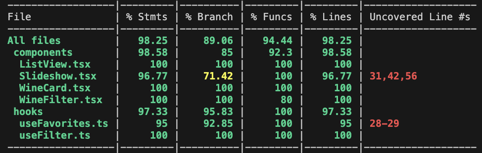

#### Test coverage

#### We have testing for all our components;

- Listview.test.tsx

  - Tests that the different wines should be visible at the site

  - Tests that a wine that is not on the site is not visible

  - Test if the favorite button changes from “add to favorites” to “remove from favorites” after you click on it.
  - Test that only 6 wines load at the time and you have to click "load more wines" for more to show.

- Slideshow.test.tsx

  - Tests that the wine changes when you click to the next wine in the slideshow

  - Test if the favorite button changes from “add to favorites” to “remove from favorites” after you click on it.

  - Tests that when you have no wines avaliable there should come a message “Product Name Not Available”

- Winefilter.test.tsx

  - Tests that you can filter on red, white and all winetypes

- Navbar.test.tsx

  - Navbar tested in the App.tsx, we test that "HOME" and "MY FAVORITES" is visible in the Navbar

- Navigation.test.tsx

  - We did not se any purpose in testing the navigation after we spoke with a TA. We were told that it was unnessecary.

#### Other relevant information about testing;

We did not see any point in testing the viewings site
because this is a component that uses listview, slideshow and winefilter, which we already have done testing for.

When it comes to testing of mobile devices and scalability we have done
these tests manually and asked other groups to test our application and give us feedback on what we need to work on.
